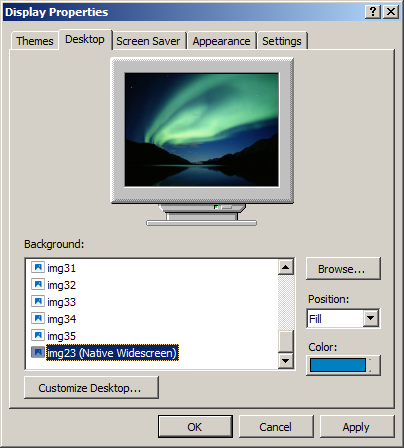
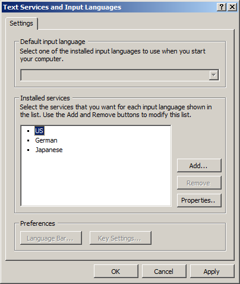

[Simple Classic Theme](https://github.com/WinClassic/SimpleClassicTheme) • [Taskbar](https://github.com/WinClassic/SimpleClassicTheme.Taskbar) • [Explorer](https://github.com/WinClassic/SimpleClassicTheme.Explorer) • **[Control Panel](https://github.com/WinClassic/SimpleClassicTheme.ControlPanel)**

#  Simple Classic Theme Control Panel

Classic reimplementation of removed control panel items.

## Screenshots

### Display Settings `(Unfinished)`

### Text Services and Input Languages `(Unfinished)`

